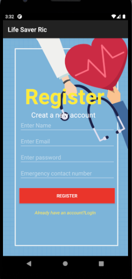
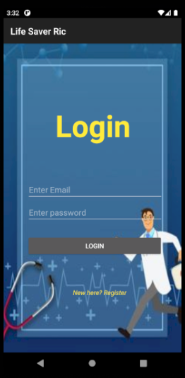
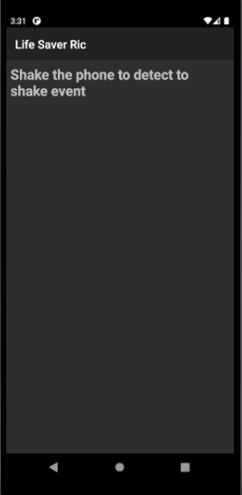
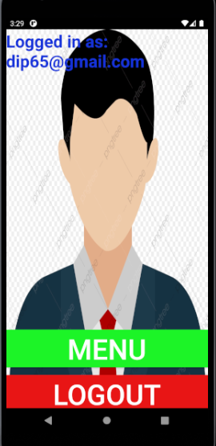
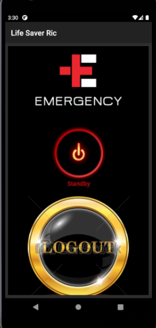

<!-- saved from url=(0059)file:///C:/Users/User1/Documents/GitHub/Group08/README.html -->
<html><head><meta http-equiv="Content-Type" content="text/html; charset=UTF-8"></head><body>

  

                                        

  <h1 align="center">Project Name: Life Saver Ric</h1>
  <h2 align="center">Course Number: CSE 299 
  Section:03 
  Semester: Fall 2020  
  Faculty Name: Shaikh Shawon Arefin Shimon</h2>
  <h3 align="center">Student Name: Rownak islam Dip 
  Student ID: 1731336042 
  Email: rownak.pip@northsouth.edu      
  Date prepared: 21/01/2021</h3>   

<h2> Project Name: Life Saver Ric</h2> 
<h3 id="table-of-contents">Table of contents</h3>

<ol>
  <a href="file:///C:/Users/User1/Desktop/Readme.html#introduction"><li>Introduction</li> </a>
  <a href="file:///C:/Users/User1/Desktop/Readme.html#features"><li>Features
    </li> </a>
  <a href="file:///C:/Users/User1/Desktop/Readme.html#technology"><li>Technology</li> </a>
  <a href="file:///C:/Users/User1/Desktop/Readme.html#businessplan"><li>BusinessPlan/Monetization</li></a> 
  <a href="file:///C:/Users/User1/Desktop/Readme.html#conclusion"><li>Conclusion</li></a> 

</ol>
 

<h2 id="#introduction">1. Introduction</h2>
<h3>1.1 Project Idea:</h3>

In 2020, it is rare to find someone without a smartphone. So, as people are already using
smartphones daily, why not make their lives safer by using an Emergency app that helps
in medical emergencies and accidents. The app will do that by calling emergency
contacts and sending live location feeds to those emergency contacts. So, they can come
to help or send help (if badly hurt or unconscious).
When feeling ill or having symptoms of illness like stroke or heart attack. You can quickly
ask for help and send your exact location. If you are in risk of being attacked you can
instantly send a distress call with current location. If attacked suddenly the struggling will
make the app send distress calls on its own. Especially useful for women safety in our
current situations. All this can be done with simple gestures. (Social and safety value)
The app helps you find nearby hospitals, police stations and their contact numbers or
call ambulance services with a single tap on the designated icon in the app. (Mass use
and monthly subscription will help fund this app. Summoning ambulance and other
services through our app would also provide a chance to earn money)

<h2 id="features">2. Features</h2>
  
Currently the following functions are available -
  

 If the user cannot open the app, he can shake his phone three times and it will send an SMS with his location to his emergency contacts.  

 It will call the users emergengy  contact and let the user talk to his emergency contacts. (Automatically) 

  In advanced countries like the USA, it will call the 911 rescue services

 Can detect the user having seizures and send location and Call emergency  contacts. 
 

 <h3>2.1 User Registration:</h3>
  To access users first have to register. Users must include username,emergency contact number,email and password. The username will be used as a primary key to identify unique users. And so username will have to be unique. Letters, digits and @/./+/-/_ are permitted only.
    
    
 

    
   Figure 1.0
 

 <h3>2.2 Login page :</h3>After completing  registration the users will be logged in automatically but they can log in manually as well. They will be introduced to the below log in page. 
   

  

   
  Figure 2.0

 
 

<h3>2.3 Shake and fall detection on standby :</h3>

The app is in stand by mode and waiting to detect any sudden changes. it will be running in background and ready to detect fall or seizures
    

  

  
   
<h3>2.4 Completion page :</h3>
The app is waiting for further user intructions
  

  
   

<h3>2.5 Menu Page :</h3>
The app is waiting for further user intructions
  

  

  

  
   
<h2 id="#technology">3. Technology</h2>
 <h3>3.1 Proposed Technology Stack: </h3>
 
The application will be developed by Android Studio. Android Studio is the official integrated development environment for Google's Android operating system, built on  JetBrains' IntelliJ IDEA software and designed specifically for Android development  Using multiple android sensors typically built-in Android devices such as gyroscope,  accelerometer, gesture control. Google API will be used for location services. 

 <h3>3.2 Implemented Technology Stack: </h3>
 

For the frontend, I used XML and Java. XML is a markup language much like  HTML used to describe data. In Android, we use XML for designing our layouts because  XML is a lightweight language, so it does not make our layout heavy. It also gives a more premium user interface and smoother experience.  

For the backend, I used Firebase. Firebase is a platform developed by  Google for creating mobile and web applications 

I used the Firebase for Database. It has a Realtime Database feature.  The Firebase Realtime Database is a cloud-hosted database. Data is stored as JSON  and synchronized in real-time to every connected client. 

 

 

<h2 id="businessplan">4. BusinessPlan/Monetization</h2>

Only the advanced features will be locked. Like many other apps, the premium app can be bought from the Google play store. A monthly subscription will also be an option by using Bkash Api to receive payment. As a safety/emergency app, it will display ads related to health care and fitness only on the button Never blocking the view or interfering with the user's interaction with the app.

<h2>5. Conclusion</h2>

In 2020, it is rare to find someone without a smartphone. So, as people are already using smartphones daily. Therefore, using an Emergency app that helps in medical emergencies and accidents is the easiest way to make their lives safer. It is especially useful for women safety in our current situations and for people with serious illness. All this can be done with simple gestures. Making this app very user friendly.  

</body></html>